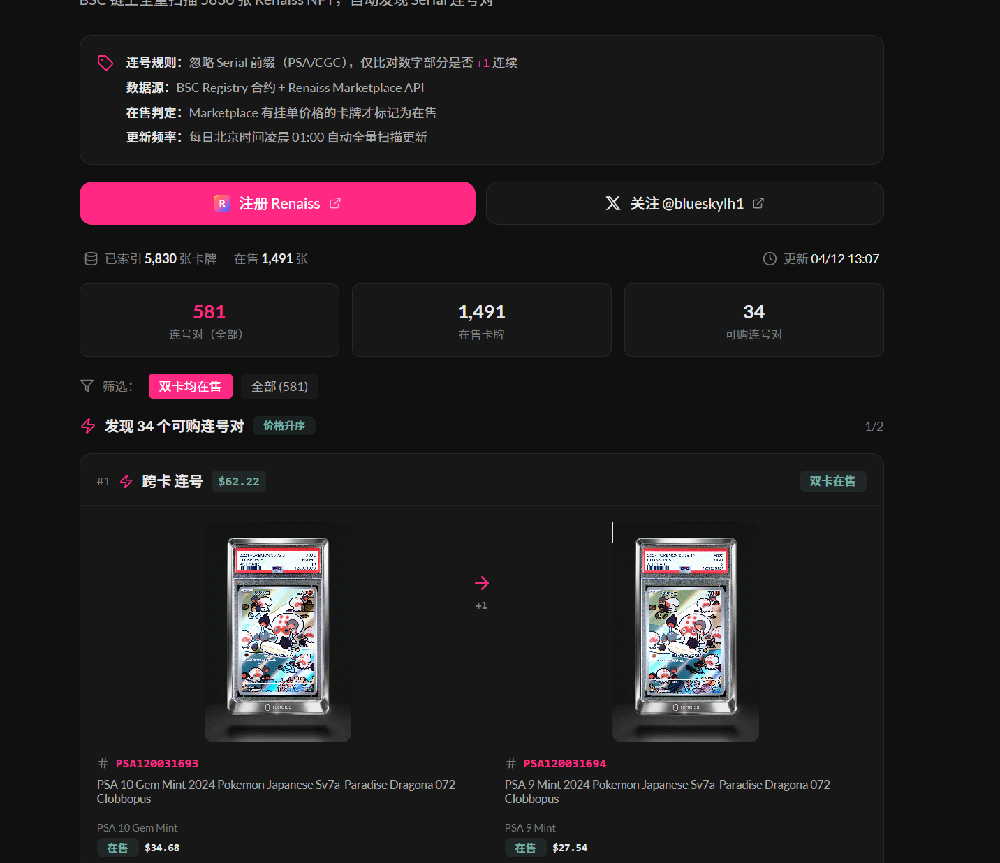

# Renaiss Scanner

监控 [Renaiss Marketplace](https://www.renaiss.xyz) 在售卡牌，自动发现**连号且双卡均在售**的组合。

---

**通过我的邀请链接注册 Renaiss → [立即注册](https://www.renaiss.xyz/ref/blueskyone)**
**关注我的 X → [Follow @blueskylh1](https://twitter.com/intent/user?screen_name=blueskylh1)**

---



## 功能

- **连号对发现**：自动扫描市场，找到序列号相邻且两张卡同时挂单的配对
- **捡漏标记**：挂单价低于 FMV 超过 $10 的卡牌自动高亮
- **FMV 显示**：每张卡显示 Fair Market Value
- **一键购买**：直接跳转到 Renaiss 对应卡牌页面
- **图片放大**：点击卡牌图片弹窗查看大图
- **多语言**：简体中文、繁体中文、English、日本語、한국어
- **每 10 分钟自动同步**市场数据

## 技术栈

| 层 | 技术 |
|---|---|
| 后端 API | Cloudflare Workers |
| 数据库 | Cloudflare D1 (SQLite) |
| 定时同步 | Workers Cron Triggers (`*/10 * * * *`) |
| 前端 | React 19 + Vite + Tailwind CSS 4 |
| UI 组件 | Radix UI + shadcn/ui |

## 项目结构

```
├── backend/
│   ├── worker.js          # Workers 入口：API 路由 + 同步逻辑
│   ├── schema.sql          # D1 建表语句
│   └── package.json
├── frontend/
│   ├── src/
│   │   ├── components/
│   │   │   ├── ConsecutiveScanner.tsx   # 主页面组件
│   │   │   └── ui/                     # shadcn/ui 组件
│   │   ├── lib/
│   │   │   ├── api.ts                  # API 地址构造
│   │   │   ├── i18n.ts                 # 多语言系统
│   │   │   └── locales/               # 翻译文件 (zh-CN, zh-TW, en, ja, ko)
│   │   └── App.tsx
│   ├── public/             # 静态资源 (logo, 头像)
│   └── package.json
├── wrangler.toml           # Workers 配置
└── logo.svg
```

## API

| 端点 | 方法 | 说明 |
|---|---|---|
| `/api/scanner` | GET | 获取连号对列表（分页），`?page=1&pageSize=10` |
| `/api/scanner/status` | GET | 同步状态（进度、时间、总量） |
| `/api/scanner/refresh` | POST | 手动触发同步（需 `x-refresh-token`） |
| `/api/health` | GET | 健康检查 |

## 本地开发

### 后端

```bash
cd backend
npm install
npm run dev    # wrangler dev，本地 D1
```

### 前端

```bash
cd frontend
npm install

# 配置 API 地址（指向本地 Workers）
cp .env.example .env
# VITE_API_BASE=http://localhost:8787

npm run dev
```

## 部署到 Cloudflare

### 前置准备

1. 注册 [Cloudflare 账号](https://dash.cloudflare.com/sign-up)
2. 安装 Wrangler CLI：
   ```bash
   npm install -g wrangler
   ```
3. 登录 Cloudflare：
   ```bash
   wrangler login
   ```

### 1. 部署后端 (Workers + D1)

#### 1.1 创建 D1 数据库

```bash
npx wrangler d1 create renaiss-scanner
```

复制返回的 `database_id`，更新 `wrangler.toml`：

```toml
[[d1_databases]]
binding = "DB"
database_name = "renaiss-scanner"
database_id = "你的-database-id"
```

#### 1.2 初始化数据库表

```bash
npx wrangler d1 execute renaiss-scanner --file backend/schema.sql
```

#### 1.3 配置环境变量

编辑 `wrangler.toml`，修改以下占位符：

```toml
[vars]
REFRESH_TOKEN = "自定义一个密钥"
FRONTEND_ORIGIN = "你的前端域名（先部署前端后填写）"
```

#### 1.4 部署 Workers

```bash
npx wrangler deploy
```

部署完成后，Workers URL 为：
```
https://<项目名>.<你的子域>.workers.dev
```

#### 1.5 验证

```bash
curl https://<项目名>.<你的子域>.workers.dev/api/health
```

预期返回：`{"ok": true}`

### 2. 部署前端 (Pages)

#### 2.1 构建前端

```bash
cd frontend

# 创建 .env，指向你的 Workers URL
cat > .env << EOF
VITE_API_BASE=https://<项目名>.<你的子域>.workers.dev
EOF

npm install
npm run build
```

#### 2.2 上传到 Cloudflare Pages

```bash
cd frontend
npx wrangler pages deploy dist --project-name=renaiss-scanner-frontend
```

部署完成后，Pages URL 为：
```
https://<项目名>.pages.dev
```

#### 2.3 更新后端 CORS 配置

将 Pages 域名填入 `wrangler.toml`：

```toml
[vars]
FRONTEND_ORIGIN = "https://<项目名>.pages.dev
```

重新部署后端：

```bash
npx wrangler deploy
```

### 3. (可选) 自定义域名

在 Cloudflare Dashboard 中：
- **Workers**：Settings → Triggers → Add Custom Domain
- **Pages**：Settings → Custom Domains → Set up a custom domain

### 4. (可选) 配置 CI/CD

将项目推送到 GitHub 后，在 Cloudflare Dashboard 中：
- Pages：Integrations → Connect to Git，选择仓库和构建命令
- Workers：可配合 GitHub Actions 自动部署

构建命令：
```bash
cd frontend && npm install && npm run build
```

输出目录：`frontend/dist`

## 数据库表结构

**renaiss_cards** — 卡牌数据

| 字段 | 类型 | 说明 |
|---|---|---|
| token_id | TEXT PK | 区块链 Token ID |
| serial | TEXT | 序列号（如 "#001"） |
| serial_num | INTEGER | 数字序列号（用于排序和连号判断） |
| name | TEXT | 卡牌名称 |
| is_listed | INTEGER | 是否在售 |
| ask_price | REAL | 挂单价 (USD) |
| fmv | REAL | Fair Market Value (USD) |
| image_url | TEXT | 卡牌图片 URL |
| ... | | 其他字段见 schema.sql |

**scan_status** — 同步状态（单行表）

## 致谢

感谢 **surf** 和 **Cloudflare** 提供的资源支持。

## License

MIT
